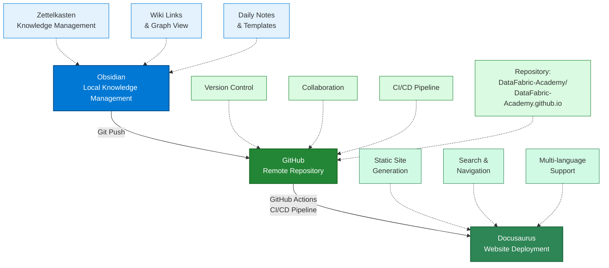

# รู้จัก Data Fabric Academy 123

ยินดีต้อนรับสู่ **Data Fabric Academy** - **ศูนย์รวมความรู้และทรัพยากรเสริม** สำหรับผู้ที่เข้าร่วมการฝึกอบรมและผู้ที่สนใจพัฒนาทักษะด้าน Data Engineering, Business Analytics และ Cloud Technologies

## 🎯 เกี่ยวกับเรา

Data Fabric Academy เป็น **Knowledge Hub** ที่ออกแบบมาเพื่อเป็นแหล่งอ้างอิงและเสริมความรู้ระหว่างและหลังการฝึกอบรม โดยใช้แนวคิด **Knowledge Fabric** ที่ผสมผสานระหว่าง:

- **Obsidian** - สำหรับจัดการความรู้แบบ Zettelkasten
- **Git & GitHub** - สำหรับ version control และ collaboration
  - Repository: [DataFabric-Academy/DataFabric-Academy.github.io](https://github.com/DataFabric-Academy/DataFabric-Academy.github.io)
  - Organization: [DataFabric-Academy](https://github.com/DataFabric-Academy)
- **Docusaurus** - สำหรับเผยแพร่เนื้อหาผ่านเว็บไซต์

:::info ทำไมต้องมี Knowledge Hub?

ระหว่างและหลังการฝึกอบรม ผู้เรียนมักต้องการ:
- **ทบทวนเนื้อหา** - กลับมาดูรายละเอียดที่อาจลืม
- **ค้นหาข้อมูลเพิ่มเติม** - หา resources และเอกสารอ้างอิง
- **ติดตามข่าวสาร** - อ่านบทความและอัปเดตล่าสุด
- **เข้าถึงได้ทุกที่ทุกเวลา** - ไม่ต้องพึ่งพาเอกสารที่อาจหาย

:::

## 📚 เนื้อหาที่เรารวบรวม

### Data Platform

ทรัพยากรความรู้เกี่ยวกับเทคโนโลยีหลักสำหรับการจัดการและวิเคราะห์ข้อมูล:

#### Microsoft SQL Server
- Database Administration และ Performance Tuning
- Query Optimization และ Index Management
- High Availability และ Disaster Recovery
- Security และ Compliance

#### Microsoft Fabric
- **End-to-end Analytics Platform** ที่รวมทุกอย่างไว้ในที่เดียว
- Data Engineering, Data Warehousing, และ Business Intelligence
- OneLake - Unified Data Lake สำหรับทั้งองค์กร
- Real-time Intelligence และ Data Science

:::tip Microsoft Fabric คืออะไร?

Microsoft Fabric เป็น **Analytics Platform** แบบใหม่ที่รวม:
- **Data Engineering** - สำหรับ ETL/ELT pipelines
- **Data Warehousing** - สำหรับ SQL analytics
- **Data Science** - สำหรับ Machine Learning
- **Business Intelligence** - Power BI integration
- **Real-time Analytics** - สำหรับ streaming data

ทั้งหมดอยู่ใน **Single Platform** ที่ใช้ **OneLake** เป็น storage layer ร่วมกัน

:::

#### Microsoft Power BI
- Data Modeling และ DAX Programming
- Report Design และ Visualization
- Power BI Service และ Governance
- Advanced Analytics และ AI Features

### Workflow Orchestration

ทรัพยากรเกี่ยวกับเครื่องมือสำหรับการสร้าง Automated Workflows:

#### Microsoft Power Automate
- Cloud Flows และ Desktop Flows
- Integration กับ Microsoft 365 และ Azure
- Business Process Automation
- RPA (Robotic Process Automation)

#### n8n
- **Open-source Workflow Automation**
- Self-hosted และ Cloud options
- Extensive integrations (500+ apps)
- Visual workflow builder
- Advanced data transformation

:::note n8n vs Power Automate

| Feature | n8n | Power Automate |
|---------|-----|----------------|
| **License** | Open-source | Commercial |
| **Hosting** | Self-hosted หรือ Cloud | Cloud-only |
| **Cost** | Free (self-hosted) | Per-user pricing |
| **Integrations** | 500+ apps | Microsoft ecosystem focus |
| **Customization** | High (code-based) | Medium (low-code) |

:::

### Power Platform

Microsoft Power Platform ecosystem:

#### Microsoft Power Automate
- Automation workflows
- Business process optimization
- Integration capabilities

#### Microsoft Power BI
- Self-service BI
- Enterprise reporting
- Embedded analytics

## 🏗️ Knowledge Fabric System

### Academy-as-Code Architecture

### ข้อดีของ Knowledge Fabric

✅ **Version Control** - เนื้อหาทุกอย่างถูก track ด้วย Git  
✅ **Collaboration** - หลายคนสามารถทำงานร่วมกันได้  
✅ **Accessibility** - เข้าถึงได้ทุกที่ทุกเวลา  
✅ **Maintainability** - แก้ไขและอัปเดตได้ง่าย  
✅ **Scalability** - เพิ่มเนื้อหาใหม่ได้ไม่จำกัด  

## 📖 วิธีใช้งาน Knowledge Hub

### สำหรับผู้เข้าร่วมการฝึกอบรม

1. **ทบทวนเนื้อหา** - กลับมาอ่านรายละเอียดที่เรียนไปแล้ว
2. **ค้นหาข้อมูล** - ใช้ Search เพื่อหาข้อมูลที่ต้องการ
3. **อ่านบทความ** - ติดตาม [Tech Blog](/blog) สำหรับเนื้อหาใหม่
4. **Clone Repository** - ดูคำแนะนำการ clone ในแต่ละหลักสูตร (ระบบ Multi-Repos)

### สำหรับผู้ที่สนใจ

1. **Browse Resources** - ดูทรัพยากรที่มีให้
2. **อ่านบทความ** - ติดตามบทความล่าสุดใน [Tech Blog](/blog)
3. **Clone Repository** - ดูคำแนะนำการ clone ในแต่ละหลักสูตร (ระบบ Multi-Repos)
4. **ติดตามอัปเดต** - [Watch repository](https://github.com/DataFabric-Academy/DataFabric-Academy.github.io) เพื่อรับการแจ้งเตือน

## 📰 Tech Blog

[Tech Blog](/blog) ของเรานำเสนอ:
- **บทความล่าสุด** - เรื่องราวใหม่ ๆ เกี่ยวกับ Data Engineering และ Cloud Technologies
- **Best Practices** - แนวทางปฏิบัติที่ดีจากประสบการณ์จริง
- **Case Studies** - ตัวอย่างการใช้งานจริง
- **Tips & Tricks** - เคล็ดลับและเทคนิคที่ช่วยให้ทำงานได้ดีขึ้น

:::tip ติดตามข่าวสารล่าสุด

เยี่ยมชม [Tech Blog](/blog) เพื่ออ่านบทความล่าสุดเกี่ยวกับ Data Engineering, Microsoft Fabric, และเทคโนโลยีที่เกี่ยวข้อง

:::

## 📚 ทรัพยากรเพิ่มเติม

### เอกสารอย่างเป็นทางการ

- **[Microsoft Fabric Documentation](https://learn.microsoft.com/fabric/)** - เอกสารอย่างเป็นทางการจาก Microsoft
- **[Power BI Documentation](https://learn.microsoft.com/power-bi/)** - คู่มือ Power BI
- **[n8n Documentation](https://docs.n8n.io/)** - คู่มือ n8n
- **[Obsidian Documentation](https://help.obsidian.md/)** - คู่มือ Obsidian

### GitHub Resources

- **[GitHub Repository](https://github.com/DataFabric-Academy/DataFabric-Academy.github.io)** - Source code และเนื้อหาทั้งหมด
- **[GitHub Organization](https://github.com/DataFabric-Academy)** - ดู repositories อื่น ๆ ใน organization
- **[GitHub Issues](https://github.com/DataFabric-Academy/DataFabric-Academy.github.io/issues)** - รายงานปัญหาและข้อเสนอแนะ
- **[GitHub Discussions](https://github.com/DataFabric-Academy/DataFabric-Academy.github.io/discussions)** - อภิปรายและถามคำถาม

## 🤝 การมีส่วนร่วม

เรายินดีรับการมีส่วนร่วมจากทุกคน! หากคุณต้องการ:

- **รายงานปัญหา** - สร้าง [Issue](https://github.com/DataFabric-Academy/DataFabric-Academy.github.io/issues) ใน GitHub
- **เสนอแนะเนื้อหา** - สร้าง [Discussion](https://github.com/DataFabric-Academy/DataFabric-Academy.github.io/discussions)
- **ส่ง Pull Request** - แก้ไขหรือเพิ่มเนื้อหาผ่าน [Pull Request](https://github.com/DataFabric-Academy/DataFabric-Academy.github.io/pulls)

### GitHub Repository

- **Main Portal**: [DataFabric-Academy/DataFabric-Academy.github.io](https://github.com/DataFabric-Academy/DataFabric-Academy.github.io)
- **GitHub Organization**: [DataFabric-Academy](https://github.com/DataFabric-Academy)

:::info Multi-Repos Architecture

Data Fabric Academy ใช้ระบบ **Multi-Repos** ซึ่งแต่ละหลักสูตรมี repository แยกกัน:

- **Main Portal** (Knowledge Hub) - [DataFabric-Academy/DataFabric-Academy.github.io](https://github.com/DataFabric-Academy/DataFabric-Academy.github.io)
- **SQL Server Course** - ดู repository และคำแนะนำการ clone ใน [หลักสูตร SQL Server](https://datafabric.academy/course-ms-sql/)
- **Power BI Course** - ดู repository และคำแนะนำการ clone ใน [หลักสูตร Power BI](https://datafabric.academy/course-power-bi/)
- **n8n Course** - ดู repository และคำแนะนำการ clone ใน [หลักสูตร n8n](https://datafabric.academy/course-n8n/)

**หมายเหตุ**: การ clone repository และการเริ่มต้นใช้งานจะแจ้งในแต่ละหลักสูตร ไม่ใช่ใน Main Portal นี้

:::

---

## 🎓 เริ่มต้นใช้งาน

เยี่ยมชม [Tech Blog](/blog) เพื่ออ่านบทความล่าสุด หรือใช้ Search เพื่อค้นหาข้อมูลที่คุณต้องการ